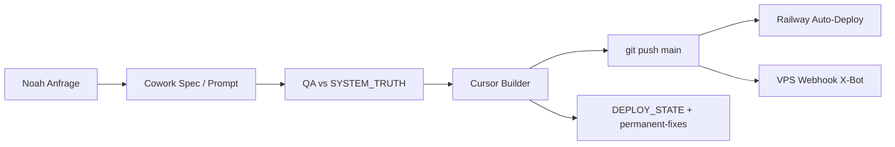

# AlphaCycle — Vollständige Projektübergabe (Claude Cowork)

> **Zweck:** Ein einziger Einstiegspunkt, damit Claude Cowork das Projekt end-to-end verstehen und weiterbauen kann — ohne Kontextverlust.
> **Stand:** 2026-04-15 · Repo `main` = `origin/main` · **SYSTEM_VERSION 1.3.6** · **ARC v1.2**
> **Owner:** Noah (BRT) · Strategische Freigaben nur durch Noah

---

## 0. Deine Rolle als Cowork

Du arbeitest im **AlphaCycle Multi-Agent-System**. Typische Aufteilung:

| Rolle | Wer | Darf |
|--------|-----|------|
| **Operating Brain** | ChatGPT | Strategie, Roadmap, Post-Deploy-Review |
| **Prompt Forge** | Claude (Cowork) | Specs, Masterprompts für Cursor, Content/Prompts |
| **Quant Research** | Claude/ChatGPT | Methodik-Audit (theoretisch), keine Formel-Änderung |
| **QA Review** | Claude | Prompts gegen SYSTEM_TRUTH prüfen |
| **Growth Engine** | Claude | X-Bot-Prompts, Accounts, Content-Strategie |
| **Cursor Builder** | Cursor | **Einziger** produktiver Code-Editor im Repo |

**Cowork kann:** alles lesen, analysieren, Specs schreiben, Prompts für Cursor liefern, Bot-Prompts (`alphacycle-x-bot/prompts/`) entwerfen, Noah beraten.

**Cowork darf ARC-Formel, Zonen, `arc_config.py` nicht ändern** ohne explizite Noah-Freigabe + Version-Bump.

**Wenn du Code direkt änderst** (falls Cowork Repo-Zugriff hat): dieselben Regeln wie Cursor — `DEPLOY_STATE.md` + `permanent-fixes.mdc` nach jeder Session; kleinste sichere Diffs.

---

## 1. Pflicht-Leseliste (SSOT) — in dieser Reihenfolge

Diese **8 Dateien** sind die einzige kanonische Wahrheit (Root-`README.md`). **Keine parallelen „Truth“-Markdowns** nutzen.

| # | Datei | Was du dort lernst | Priorität |
|---|--------|-------------------|-----------|
| 1 | `docs/SYSTEM_TRUTH.md` | **LOCKED:** ARC-Formel, ECB, Zonen, Hi/Lo, Decision, Sprache | Zuerst, auswendig |
| 2 | `docs/AI_MASTER_CONTEXT.md` | Vollarchitektur: Dashboard, Blur-Gates, APIs, Bot, 7 Signal-Layer | Komplett |
| 3 | `docs/AI_AGENT_ROLES.md` | Agent-Grenzen, Init-Protokoll | Komplett |
| 4 | `docs/AI_MASTER_PROMPT.md` | Verhalten, Anti-Drift, Cursor-Appendix | Komplett |
| 5 | `docs/AI_AGENT_MASTERPROMPTS.md` | Copy-Paste-Masterprompts pro Agent (6 Agents) | Deine Sektion + Shared Rules |
| 6 | `docs/SYSTEM_STATE.md` | Phase PRE-REVENUE, Infra, Known Issues, nächste Prioritäten | Snapshot |
| 7 | `docs/SYSTEM_VERSION.md` | Version **1.3.6**, Bump-Regeln | Bei Doc-Änderungen |
| 8 | `docs/TASK_PIPELINE.md` | Task-IDs T-001…T-013, Status, betroffene Dateien | Vor jeder Arbeit |

**Zusätzlich Pflicht bei jeder Code-/Deploy-Session:**

| Datei | Zweck |
|--------|--------|
| `DEPLOY_STATE.md` | Chronologisch: was zuletzt live geändert wurde |
| `.cursor/rules/permanent-fixes.mdc` | **NIEMALS rückgängig** — Fetcher, main.py, scoring, index.html, X-Bot |
| `.cursor/rules/alphacycle-build.mdc` | Cursor Build-Modus: minimal, audit-first |
| `.cursor/rules/workflow.mdc` | Commit + DEPLOY_STATE nach Änderung |

**Diese Übergabe (`COWORK_HANDOVER.md`):** Index + operative Details; bei Widerspruch gewinnt immer **SYSTEM_TRUTH** > **permanent-fixes** > **AI_MASTER_CONTEXT**.

---

## 2. Produkt in einem Satz

**AlphaCycle** ist ein live **Bitcoin Cycle Intelligence SaaS** (`https://alphacycle.app`): misst strukturelles Marktrisiko mit dem **ARC Index (0–100)** und fünf Zonen. Es ist **kein** Trading-Signal-Tool, sondern **Regime-Klassifikation** mit historisch gerahmter Decision/Allocation.

---

## 3. Live-Infrastruktur

| Service | URL / Host | Deploy | Notizen |
|---------|------------|--------|---------|
| **Frontend** | `https://alphacycle.app` | Netlify (Root `index.html`) | Single-File ~8727 Zeilen |
| **Backend** | `https://alphacycle-production.up.railway.app` | Railway, Push `main` | FastAPI, `BACKEND_URL` in index.html |
| **Auth/DB** | Supabase `epcvkgtneeafgpjjrfiq.supabase.co` | Env auf Railway | Free Tier; Cron Keep-Alive VPS alle 5 Tage |
| **Stripe** | Test Mode | Env: `STRIPE_*` | **Blockiert:** US LLC für Live |
| **X-Bot + Telegram** | Hetzner `95.216.152.31` | **GitHub Webhook → deploy-server** | Screens: `xbot`, `tg`; Repo-Pfad typ. `/root/alphacycle-repo/alphacycle-x-bot` |

### VPS Bot (Noah / Ops)

```bash
ssh root@95.216.152.31
cd ~/alphacycle-repo/alphacycle-x-bot
./restart-screens.sh          # .venv aktivieren, bot + telegram_listener
screen -r xbot                # Bot-Log
screen -r tg                  # Telegram-Listener
```

Deploy-Server: `alphacycle-x-bot/deploy-server/deploy.py` — bei `git pull`-Fehler: `fetch` + `reset --hard origin/main`, dann `restart-screens.sh`.

---

## 4. Repository-Map (jede wichtige Datei)

```
alphacycle-main/
├── index.html                    # GESAMTES Frontend (CSS+JS inline)
├── netlify.toml                  # Frontend-Hosting
├── DEPLOY_STATE.md               # Deploy-Chronik (immer aktuell halten)
├── README.md                     # 8-Doc-Leseliste + alte Render-Anleitung
├── docs/
│   ├── SYSTEM_TRUTH.md           # LOCKED Regeln
│   ├── AI_MASTER_CONTEXT.md      # Architektur (~780+ Zeilen)
│   ├── AI_AGENT_ROLES.md
│   ├── AI_MASTER_PROMPT.md
│   ├── AI_AGENT_MASTERPROMPTS.md
│   ├── SYSTEM_STATE.md
│   ├── SYSTEM_VERSION.md
│   ├── TASK_PIPELINE.md
│   └── COWORK_HANDOVER.md        # DIESE DATEI
├── .cursor/rules/
│   ├── permanent-fixes.mdc       # Größte technische SSOT neben Code
│   ├── alphacycle-build.mdc
│   └── workflow.mdc
├── backend/
│   ├── main.py                   # ~2093 Z. — FastAPI, Cache, alle /api/*
│   ├── arc_config.py             # ARC_WEIGHTS, Zonen, VERSION — NUR mit Noah
│   ├── scoring.py                # compute_arc_score, ECB, arc_display
│   ├── fetcher.py                # Kraken, OKX, FRED, CoinCap, gather(13)
│   ├── decision_engine.py        # get_position, Allocations
│   ├── historical_returns.py     # 5 Zonen, forward returns, euphoria drawdown
│   ├── analyzer.py               # Phase aus cycle_anchor (NICHT aus ARC)
│   ├── cycle_anchor.py           # TENTATIVE_CYCLE_TOP 2025-10-06
│   ├── liquidity_engine.py       # bond_score aus Yield-Level (Bug-Fix)
│   ├── seasonality.py
│   ├── snapshot.py               # build_snapshot für /api/snapshot
│   ├── auth.py                   # Supabase Bearer
│   ├── database.py               # Supabase Client lazy
│   ├── requirements.txt
│   ├── Dockerfile                # PORT, workers=1
│   ├── data/btc_daily_kraken.csv # Historie ab 2013
│   └── services/backtest_engine.py  # NUR run_daily_backtest_full()
└── alphacycle-x-bot/
    ├── bot.py                    # Scan-Loop + schedule Daily 13:00 UTC
    ├── config.py                 # 42 Accounts, Limits, CLAUDE_MODEL
    ├── scanner.py                # 3-Layer Off-Topic + spacing
    ├── reply_engine.py           # Claude Replies
    ├── growth_engine.py          # Prompts, QA, keine HTTP außer QA
    ├── daily_post_engine.py      # Daily Posts + ARC fetch
    ├── poster.py                 # X post + Telegram handoff
    ├── signal_visual.py          # 1200x675 PNG für Daily
    ├── telegram_bot.py / telegram_listener.py
    ├── database.py               # SQLite
    ├── restart-screens.sh        # .venv Pflicht
    ├── deploy-server/            # Webhook Deploy
    └── prompts/
        ├── reply_system.txt      # Reply System v3
        ├── post_system.txt       # Daily, link-frei
        └── qa_system.txt         # 13 Regeln Haiku
```

---

## 5. ARC Engine — das musst du auswendig können

### Formel (LOCKED v1.2)

```
ARC = ma_200w×0.35 + drawdown×0.30 + liquidity×0.15 + fear_greed×0.20
```

- **SSOT:** `backend/arc_config.py` → `ARC_WEIGHTS`, `ARC_FORMULA_VERSION = "1.2"`
- **Berechnung:** nur `scoring.compute_arc_score()` — **NIEMALS** `combined_score` als ARC
- **Backtest:** nur `run_daily_backtest_full()` — Weekly-Fallback gelöscht
- **Display:** `arc_display_score(arc_raw, k=0)` → mit k=0 **raw = display**
- **Hero-Zone-Name:** UI nutzt **rohen** `arc_score` (`phaseOf`), nicht display

### Zonen (Halbintervalle)

| Zone | Grenze | Farbe (UI) |
|------|--------|------------|
| Deep Value | &lt; 30 | #00D4AA / #22c55e |
| Accumulation | &lt; 40 | #00B4D8 |
| Expansion | &lt; 40–59 | #58A6FF |
| Risk Rising | &lt; 70 | #FF9500 |
| Euphoria | ≥ 70 | #FF3B3B |

### ECB (Extreme Condition Boost)

Dual-Extreme trend+sentiment: +3/+7; drawdown+sentiment unten: −3/−7. Siehe `SYSTEM_TRUTH.md` §2.

### Liquidity Impulse (ARC-Zeile)

`Impulse = 50 − 30d_change×2.5 − 90d_change×1.5` auf Net Liquidity (WALCL−TGA−RRP), ≥22 Punkte.

### Hi/Lo Engine (**im Code deployed**, T-002 in Pipeline veraltet)

- `fetch_kraken_ohlc_latest()` → `CACHE["ohlc_latest"]`
- `compute_arc_score(weekly_high=, weekly_low=)` in Live + Backtest (Kraken Tages-H/L)
- **Wichtig:** `results[-1] = dict(results[-1])` vor Live-Override in `/api/backtest` und `/api/history-daily` (Cache nicht mutieren)

### Phase vs ARC

- **Cycle Phase** (`phase_context`): nur aus `cycle_anchor` / `analyzer` — **ARC ist Thermometer, nicht Phase**
- **Decision Engine:** phase-coherent (Bear/Bull-Gruppen) + ARC-Rohschwellen; `get_arc_summary()` in `main.py`

---

## 6. Datenpipeline (Backend)

`fetcher.fetch_all()` — **genau 13** `asyncio.gather`-Aufrufe:

0–3 Kraken (BTC/ETH prices + ticker), 4 funding (**OKX**, nicht Binance), 5 TVL, 6 stable, 7 WALCL, 8 DGS10, 9 global (**CoinCap**, nicht hardcoded 55), 10 funding, 11 WTREGEN, 12 RRPONTSYD.

- **Kein** CoinGecko BTC/ETH in gather (429 auf Railway)
- **Preise:** Kraken primär; `refresh_cache()` kann `btc_prices` aus Daily-Cache (>1400 Tage) überschreiben
- **Binance/Bybit:** auf Railway 403 — verboten für Funding

---

## 7. Wichtigste API-Endpunkte

Vollständige Tabelle: `AI_MASTER_CONTEXT.md` §11. Kern für Produkt/Bot:

| Endpoint | Nutzen |
|----------|--------|
| `GET /health` | Smoke test |
| `GET /api/arc-summary` | **Zentrale** Live-Daten: arc_score, zone_name, components, phase, decision, eth_btc_signal, seasonality |
| `GET /api/historical-returns` | Zonen-Forward-Returns (5 Zonen) |
| `GET /api/backtest` | 10Y Daily ARC-Serie |
| `GET /api/history-daily` | Letzte 365 Tage + Live-Override letzter Punkt |
| `GET /api/zone-history` | Perioden aus Backtest-Cache (min 4 Wochen) |
| `GET /api/analyzer` | Phase, short term context |
| `GET /api/snapshot` | X-Bot Snapshot |
| `GET /api/auth/profile` | plan, trial, stripe status |
| `POST /api/checkout` | Stripe Subscription |
| `POST /api/stripe-webhook` | Entitlements (immer 200) |
| `POST /api/subscribe` | email_captures Supabase |

**Rate Limits (slowapi):** default 100/min; analyzer/decision/snapshot 30/min; subscribe 10/min; profile 20/min; webhook exempt.

---

## 8. Frontend (`index.html`) — Struktur & Fallen

### Architektur

- **Eine Datei** ~8727 Zeilen: `BACKEND_URL = 'https://alphacycle-production.up.railway.app'`
- **Laden:** `Promise.allSettled` (nicht `Promise.all`)
- **Views:** `landing-view` | `dashboard-view` | `track-record-view` — `showLanding()` / `showDashboard()` / `showTrackRecord()`
- **Auth:** Supabase JS, `fetchUserPlan()`, `applyBlurGates()`, `initAuth()` in `boot()`

### Blur-Gates (Monetarisierung)

| Tier | Gates | Locked wenn |
|------|-------|-------------|
| free | gate-hero, gate-historical-returns | `effectivePlan === 'anonymous'` |
| paid | cycle, near-term, arc-history, momentum, decision, zone-history, export | `effectivePlan !== 'paid'` |
| — | gate-live-prices | **nie** locked |

`effectivePlan`: `trial` = wie `paid`.

### Bekannte UI-States (2026-04)

- `#signal-summary`, `#gate-zone-history`, `.dec-layer-3` per CSS **hidden**
- HR-Grid oft hidden; **hr-* IDs bleiben im DOM** (JS braucht sie)
- Orbit Hero: conic gradient ring, `positionOrbitDot`, Labels `.ol-dv`…`.ol-eu` — Mobile-Fixes in permanent-fixes
- ARC Chart: Chart.js + zoom, zoneRects, 10Y default 2Y zoom, `autoFitPriceAxis`
- **Data Inspector** am Seitenende — Liquidity-Key `components.liquidity` / `macro_liq`, nicht `btc.liquidity`

### IDs nicht doppeln

`landing-now-return` nur einmal; Duplikat → `landing-now-return-2`.

---

## 9. X-Bot — Verhalten & Limits

### Flow

```
bot.py run_cycle → scanner (Bearer) → reply_engine (Claude Opus default)
  → growth_engine QA (Haiku) → telegram_bot approval
  → User POST in Telegram → poster (OAuth1 Daily / Telegram-only Replies)
```

- **Replies:** kein `create_tweet(in_reply_to)` — nur Telegram Copy + manuell
- **Daily:** 13:00 UTC, `pending_daily_posts`, optional `signal_visual` PNG
- **ARC:** `ARC_API_URL` = Railway `/api/arc-summary` (**nicht** alphacycle.app SPA)

### Scanner (3 Layer)

1. `BLOCKED_KEYWORDS` — alle Tiers
2. `RELEVANT_KEYWORDS` — nur Tier 2+3; **Tier 1 bypass**
3. Claude `SKIP_OFF_TOPIC` in `reply_system.txt`

### Defaults (config.py / letzte Sofort-Maßnahmen — .env überschreibt)

- **42** tracked accounts (11+16+15)
- `SCAN_INTERVAL_SECONDS=1800` (30 min) in Repo-Defaults zuletzt erhöht
- `REPLY_LIMIT_HOURLY=10`, `REPLY_LIMIT_DAILY=30` (DEPLOY 2026-04-14; Doku an manchen Stellen noch 5/15 — **config.py + .env prüfen**)
- `WEBSITE_EMBARGO=True` — **keine Links** in Posts
- `CLAUDE_MODEL=claude-opus-4-6` — **teuer**; Usage beobachten

### Telegram Ops (neu 2026-04-15)

- `/health`, `/cmd <allowlist>`, Menü-Buttons `menu:health`, `menu:cmdhelp`
- Nur `TELEGRAM_ALLOWED_CHAT_IDS`

### PLANNED (HIGH)

**Reply-back notifications** — wenn jemand @Real_AlphaCycle antwortet → Telegram-Alert (75× Algorithm-Gewicht).

---

## 10. Auth, Payments, Entitlements

- **Supabase:** `user_profiles.plan` = free | paid | trial; Trial 7 Tage aus `created_at`
- **Stripe:** Checkout + Webhook; Mapping `STRIPE_STATUS_TO_PLAN`; Webhook **immer** 200 `{"received": true}`
- **Frontend:** kein `alert()` — `showPlanWarning()`; `#upgrade-success` Poll
- **Backend ist SSOT** für Plan — Frontend erfindet keine Entitlement-Logik

---

## 11. Task-Pipeline — was als Nächstes gebaut werden soll

| ID | Status | Aktion für Cowork |
|----|--------|-------------------|
| **T-001** | ✅ Deployed | ARC v1.2 live |
| **T-002** | ⚠️ Doku „nicht deployed“, **Code hat Hi/Lo** | Pipeline-Eintrag aktualisieren; prod verifizieren |
| **T-003** | Prompt ready | Hero Orbit Label CSS |
| **T-004** | Prompt ready | UX: Signal Summary JS, dec-layer-3, Spacing |
| **T-005** | Prompt ready | Ring clarity CSS |
| **T-006** | Partial | Docs konsolidieren nur mit Noah-Freigabe |
| **T-007** | **READY** | Post-Deploy: `#track-dv-return` vs API, Landing-Zahlen |
| **T-008** | Backlog | Zone History confirmed vs live_zone |
| **T-010** | Blockiert | LLC → Stripe Live |
| **T-013** | Backlog | Bot Self-Learning |

**Reihenfolge laut SYSTEM_STATE:** T-003 → T-004 → T-007 → Revenue-Pfad.

---

## 12. Bekannte Issues (nicht ignorieren)

| # | Issue | Workaround |
|---|--------|------------|
| 1 | Zone History vs Live-ARC | Section hidden CSS |
| 2 | CSS !important Schulden | Vorsicht bei neuen Styles |
| 3 | Orbit Label Overlap | T-003 |
| 4 | Landing Event-% ≠ Zonen-Durchschnitt | #track-dv-return muss API deep_value.avg_12m sein |
| 5 | Auth „failed to fetch“ | Offen — DevTools |
| 6 | CoinCap DNS fail | Non-critical |
| 7 | Doku-Drift Reply-Limits 5/15 vs 10/30 | Immer `config.py` lesen |

---

## 13. Sprache & Brand (Content + UI)

**Verboten in User-facing:** BUY, SELL, SIGNAL, Vorhersagen, 10/10, Hashtags, $BTC, alphacycle.app in Bot-Posts/Replies.

**Erlaubt:** PHASE, REGIME, historisch, typisch, „Bottom Formation Signal“.

**Posts:** max 2 Datenpunkte; **Replies:** max 260 Zeichen (QA + `_enforce_reply_telegram_char_limit`).

---

## 14. Workflow für neue Features (Pflicht)



**Jeder Cursor-Prompt beginnt mit:**

```
BEVOR du anfängst:
1. docs/SYSTEM_TRUTH.md
2. docs/AI_MASTER_CONTEXT.md
3. DEPLOY_STATE.md
4. .cursor/rules/permanent-fixes.mdc

[NUR DIESE ÄNDERUNGEN]

NACHHER: DEPLOY_STATE.md + permanent-fixes.mdc aktualisieren, commit, push
```

---

## 15. Environment Variables (Checkliste)

### Railway / Backend

- `FRED_API_KEY`
- `SUPABASE_URL`, `SUPABASE_SERVICE_ROLE_KEY`
- `STRIPE_SECRET_KEY`, `STRIPE_WEBHOOK_SECRET`, `STRIPE_PRICE_ID`
- `PORT` (von Railway gesetzt)

### VPS `alphacycle-x-bot/.env`

- Twitter OAuth1 + Bearer
- `CLAUDE_API_KEY`, `CLAUDE_MODEL` (Opus = teuer)
- `TELEGRAM_BOT_TOKEN`, `TELEGRAM_CHAT_ID`
- `ARC_API_URL` → Railway arc-summary
- Optional: Scan/Reply-Limits, `GITHUB_WEBHOOK_SECRET` in `deploy-server.env`

**Secrets nie committen.**

---

## 16. Smoke-Tests nach Deploy

### Backend

```text
GET https://alphacycle-production.up.railway.app/health
GET .../api/arc-summary  → arc_score, zone_name, components.macro_liq, phase_context
GET .../api/historical-returns → zones.deep_value.avg_12m
```

### Dashboard

- Anonymous: Hero + HR sichtbar, Cycle/ARC Chart blurred
- Login Free: HR unlocked, Paid gates locked
- Trial/Paid: alle Gates offen
- Data Inspector: ARC raw + display, Net Liq, kein [object Object]

### X-Bot (VPS)

- `screen -ls` → xbot, tg
- Telegram `/health`, `/status`
- Scan-Log: keine Spam-Replies; Tier-1 ohne off_topic

---

## 17. Widersprüche / Drift — Cowork soll das kennen

| Thema | Doku sagt | Code/Reality |
|--------|-----------|--------------|
| T-002 Hi/Lo | TASK_PIPELINE: nicht deployed | `fetch_kraken_ohlc_latest` + `ohlc_latest` in main.py ✅ |
| Reply limits | AI_MASTER_CONTEXT: 5/hr, 15/day | config Sofort-Maßnahmen: 10/30 — **config.py prüfen** |
| Free user Cycle Overview | Alte README-Texte | **paid gate** in `gateInfo` |
| Beehiiv | Alte Marketing-Texte | Nur `/api/subscribe` + Supabase |

Bei Konflikt: **Code + permanent-fixes** schlagen veraltete README-Abschnitte.

---

## 18. Cowork Start-Checkliste (Tag 1)

- [ ] Alle 8 README-Docs gelesen
- [ ] `permanent-fixes.mdc` komplett (lang, aber Pflicht)
- [ ] `DEPLOY_STATE.md` letzte 20 Einträge
- [ ] `TASK_PIPELINE.md` ACTIVE + BACKLOG
- [ ] Live `GET /api/arc-summary` einmal gecallt
- [ ] `index.html` grep: `applyBlurGates`, `phaseOf`, `BACKEND_URL`
- [ ] `backend/arc_config.py` + `scoring.compute_arc_score` gelesen
- [ ] `alphacycle-x-bot/config.py` TRACKED_ACCOUNTS + Limits
- [ ] Rolle bestätigt: „Ich ändere ARC nur mit Noah + Version bump“

---

## 19. Was „fertig bauen“ für AlphaCycle bedeutet

**Kurzfristig (Produkt):**

1. Dashboard Polish T-003–T-005, T-007 Verifikation
2. Zone History Fix T-008 (Daten + UI wieder an)
3. Reply-back Telegram Alerts (geplant HIGH)
4. Auth-Bug investigieren

**Mittelfristig (Business):**

1. LLC → Stripe Live → Paid Launch $49/mo
2. Alert Emails (Resend)
3. Docs T-006 Abschluss (mit Freigabe)

**Niemals ohne Prozess:**

- ARC-Gewichte / Zonen / ECB ändern
- Zweite Wahrheits-Docs neben README-8er-Liste
- Binance für Preise/Funding auf Railway
- `combined_score` als ARC ausgeben

---

## 20. Kontakt & Eskalation

- **Entscheidungen:** Noah
- **ARC-Methodik-Änderung:** Noah + Quant Research + Version bump + Backtest
- **Produktions-Notfall:** `AI_MASTER_CONTEXT.md` §10 Emergency Procedures
- **Nach Doc-Session:** Noah informieren welche Agenten README-Stack neu laden (SYSTEM_VERSION Zeile nennen)

---

*Diese Übergabe ersetzt keine Pflicht-Docs — sie verlinkt und operationalisiert sie für Cowork. Bei Updates: Datum oben anpassen + Eintrag in DEPLOY_STATE.md.*
